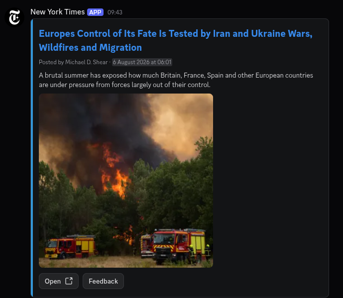
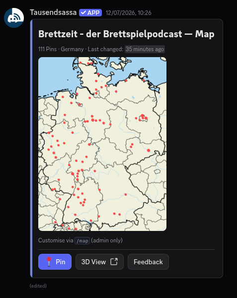
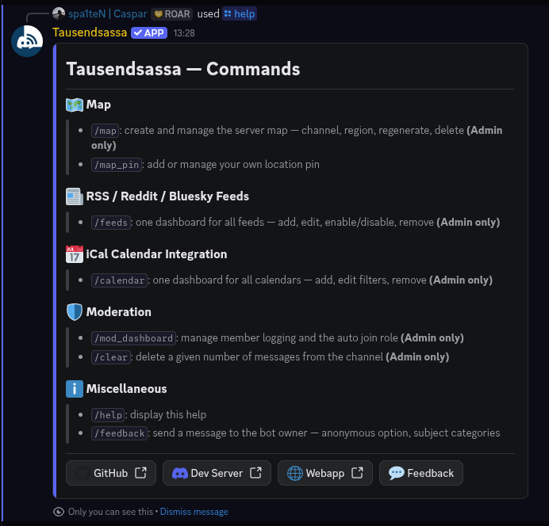
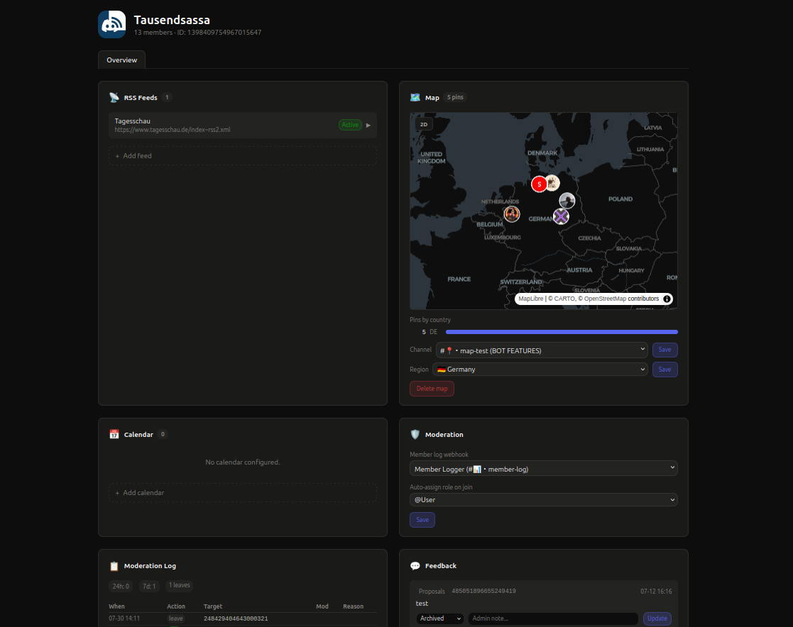

<p align="center">
  
</p>

<h1 align="center">Tausendsassa</h1>

<p align="center">
  <strong>Multi-purpose Discord bot</strong> — RSS/Reddit/Bluesky news feeds,
  interactive map, iCal calendar sync, moderation logging, and a web
  admin dashboard. Built with discord.py and PostgreSQL, deployed via Docker.
</p>

<p align="center">
  <a href="https://discord.com/oauth2/authorize?client_id=1398477775828029645&permissions=537259968&scope=bot%20applications.commands">
    
  </a>
  <a href="https://discord.gg/yVNkpH6vDS">
    
  </a>
  <a href="https://tausendsassa.casparsadenius.de">
    
  </a>
</p>

<p align="center">
  
  
  
  
</p>

---

**[Invite the Bot](https://discord.com/oauth2/authorize?client_id=1398477775828029645&permissions=537259968&scope=bot%20applications.commands)**
·
**[Web Admin Panel](https://tausendsassa.casparsadenius.de)**
·
**[Support Server](https://discord.gg/yVNkpH6vDS)**
·
**[Privacy Policy](https://tausendsassa.casparsadenius.de/privacy)**
·
**[Terms of Service](https://tausendsassa.casparsadenius.de/terms)**

### Features

| | |
|---|---|
| **News Feeds** | RSS, Atom, Reddit (subreddits & users), Bluesky — 89+ feeds across 65+ servers. Rich CV2 embeds with MediaGallery, RedGifs to GIF conversion, per-feed webhook avatars |
| **Interactive Map** | Pinboard with Natural Earth rendering, 3D globe view, per-guild regions. Users set pins via slash commands; Discord CV2 cards with media and action buttons |
| **Calendar** | iCal/ICS sync with automatic Discord event lifecycle (create, start, end), weekly summaries, blacklist/whitelist filtering |
| **Moderation** | Join/leave logging, kick/ban/timeout tracking with moderator attribution, purge command, auto-join role |
| **Feedback** | Per-server `/feedback` with subject categories, anonymous toggle, status workflow (new, important, in_progress, archived) |
| **Web Panel** | Discord OAuth2 admin dashboard at [tausendsassa.casparsadenius.de](https://tausendsassa.casparsadenius.de) — manage feeds, calendars, maps, moderation, and feedback across all your servers |

### Screenshots

<table>
  <tr>
    <td><strong>Feed Post (CV2)</strong></td>
    <td><strong>Interactive Map</strong></td>
  </tr>
  <tr>
    <td></td>
    <td></td>
  </tr>
  <tr>
    <td><strong>/help Command</strong></td>
    <td><strong>Web Admin Panel</strong></td>
  </tr>
  <tr>
    <td></td>
    <td></td>
  </tr>
</table>

> **Documentation**:<br/>
> **[DATA_INTERFACE.md](DATA_INTERFACE.md)** — API contract for dashboard consumers<br/>
> **[CLAUDE.md](CLAUDE.md)** — detailed architecture, key invariants, and development guide

---
### Architecture

```
cogs/           Discord cogs (slash commands, listeners)
  feeds.py      Feed polling, posting, /feeds dashboard
  calendar.py   iCal sync, Discord events, reminders
  map.py        Interactive map with user pins (CV2 LayoutView)
  moderation.py Join/leave logs, kick/ban/timeout, purge
  help.py       /help command
  feedback.py   /feedback command, modal, CV2 menu

core/           Business logic
  feeds_cv2.py        CV2 LayoutView builder
  feeds_rss.py        RSS fetch, parse, embed creation
  feeds_thumbnails.py Image extraction (Bluesky, OG images)
  media_downloader.py RedGifs API + GIF conversion
  map_storage.py      Map image cache management
  api_server.py       Internal API (port 8090)

db/             PostgreSQL via asyncpg, repository pattern
webapp/         FastAPI admin panel (Discord OAuth2)
resources/      Static assets (favicon, screenshots)
```
### Container
| Container | Role | Port |
|:---|---:|:---|
| `tausendsassa-bot` | Discord bot + internal API | :8090 (internal) |
| `tausendsassa-db-browser` | Dashboard API + feedback CRUD | :8080 (internal) |
| `tausendsassa-webapp` | FastAPI admin panel | :8081 (published, proxied) |
| `tausendsassa-db` | PostgreSQL 16 | --- |

---
## Setup
### Prerequisites:
> - Docker and Docker Compose
> - A [Discord Bot Application](https://discord.com/developers/applications) with token
> - (Optional) Discord OAuth2 client for the web panel

### 1. Clone the repo and configure environment:
```bash
git clone https://github.com/spa1teN/Tausendsassa.git
cd Tausendsassa
cp .env.example .env
```
<sup>*in `.env` — set `DISCORD_TOKEN` and `DB_PASSWORD` at minimum* </sup>
### 2. Start all services and check health:
```bash
docker compose up -d
docker compose logs bot --tail 20
curl -s http://localhost:8081/  # should return 307 (redirect to /login)
```

### Required Bot Permissions

- **Send Messages** & **Embed Links** — feed posts and embeds
- **Manage Webhooks** — per-feed webhook posting
- **Attach Files** — map images, feed media, GIFs
- **Create Events** — calendar to Discord event sync
- **Read Message History** — map message editing
- **Use External Emojis** — feed formatting

## License

MIT © [spa1teN](https://github.com/spa1teN)

The bot's [Privacy Policy](https://tausendsassa.casparsadenius.de/privacy) and
[Terms of Service](https://tausendsassa.casparsadenius.de/terms) apply to all
users of the hosted instance.
